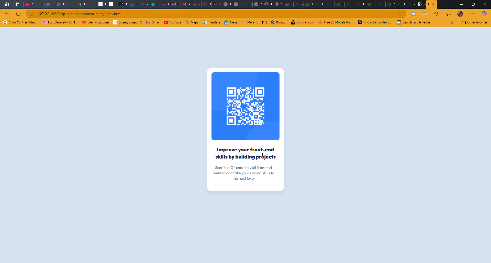

# Frontend Mentor - QR code component solution

This is a solution to the [QR code component challenge on Frontend Mentor](https://www.frontendmentor.io/challenges/qr-code-component-iux_sIO_H). Frontend Mentor challenges help you improve your coding skills by building realistic projects. 

## Table of contents

- [Overview](#overview)
  - [Screenshot](#screenshot)
  - [Links](#links)
- [My process](#my-process)
  - [Built with](#built-with)
  - [What I learned](#what-i-learned)
  - [Continued development](#continued-development)
  - [Useful resources](#useful-resources)
- [Author](#author)
- [Acknowledgments](#acknowledgments)

**Note: Delete this note and update the table of contents based on what sections you keep.**

## Overview

### Screenshot




### Links


- Live Site URL: [fmfirstproject.netlify.app]( https://triciodevs.github.io/FM-challenge-1/)

## My process

### Built with

- Semantic HTML5 markup
- CSS custom properties
- Flexbox


### What I learned

How to practically make the project responsive to all devices 

```css
////
    @media (max-width: 1313px) {

  .container {
    width: 100px;
    padding: 10px;
  }
}

/* for huge tablets */


@media (max-width: 1167px) {
  .container {
    width: 120px;
    padding: 5px;
  }
}


/* for tablets */


@media (max-width: 768px) {

  .container {
    width: 100px;
    padding: 10px;
    flex-direction: column;
  }
}


/* for phones */

@media (max-width: 320px) {

  .container {
    width: 50px;
    padding: 20px;
  }
} 


### Continued development

I would like to improve generally in how I add depth to cards  or profile to make it look more professional without ignoring the proper use of semantic html


### Useful resources

- [Example resource 1](https://developer.mozilla.org/en-US/docs/Web/CSS/CSS_text/Wrapping_breaking_text) - This helped me in sizing the text width. I really liked this pattern and will use it going forward.


## Author

- Frontend Mentor - [@triciodevs](https://www.frontendmentor.io/profile/triciodevs)


## Acknowledgments
learnt a few things from mdn web docs along the way and mdn web documents 
